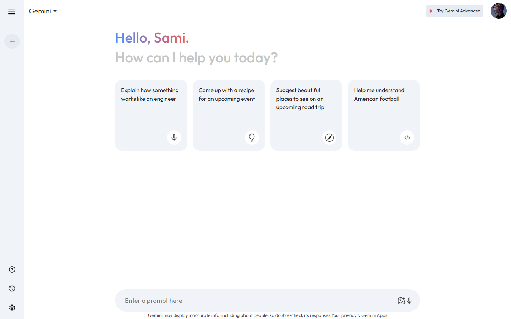
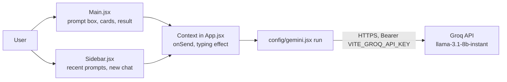

# Gemini Clone

A React + Vite copy of the Google Gemini chat interface: send a prompt and the answer is typed out word by word, with a sidebar of recent prompts.

Built while following GreatStack's "Gemini clone with React" tutorial as a learning project. The file layout (`config/gemini`, `context`, `main/Main`, `sidebar/Sidebar`, `assets/assets.js`), the `delayPara` typing effect and the `**` to `<b>` response formatting all match that tutorial.

**Live UI:** https://gemini-rho-gray.vercel.app. The interface loads. Chat replies depend on the deployment's API key, which was not tested.



## Status

Learning project. The model backend was switched after Google deprecated the original model:

- **Current:** `src/config/gemini.jsx` calls the **Groq** OpenAI-compatible Chat Completions API with `llama-3.1-8b-instant`. Despite the project name, replies come from Llama via Groq, not from Gemini.
- The original `@google/generative-ai` (Gemini) code is still in the file but commented out.

## Features (from the code)

- Prompt input. Clicking a suggestion card or a recent prompt re-sends it.
- Loading state while waiting for the reply.
- Word-by-word typing animation, with basic markdown handling (`**bold**` becomes bold and `*` becomes a line break).
- Collapsible sidebar with recent prompts (in memory only, not saved) and a "New chat" button.
- Global state through React Context, defined in `App.jsx`.

## Architecture



## Tech stack

React 18, Vite 5, plain CSS, MUI icons. The model is called with `fetch` against the Groq API.

## Getting started

```bash
npm install
echo "VITE_GROQ_API_KEY=your_key" > .env
npm run dev
```

## Environment variables

| Name | Purpose |
|------|---------|
| `VITE_GROQ_API_KEY` | Groq API key used by `src/config/gemini.jsx` |

> **Note:** `VITE_` variables are bundled into the client JavaScript, so this key is visible to anyone who opens the deployed site. For real use, send requests through a small server-side proxy instead.
